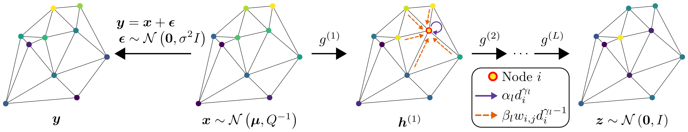

# Scalable Deep Gaussian Markov Random Fields for General Graphs
<p align="middle">
  
</p>

This repository contains the code for our paper [*Scalable Deep Gaussian Markov Random Fields for General Graphs*](https://proceedings.mlr.press/v162/oskarsson22a.html).

If you find our work useful, please cite:
```
@inproceedings{graph_dgmrf,
    author = {Oskarsson, Joel and Sid{\'e}n, Per and Lindsten, Fredrik},
    title = {Scalable Deep {G}aussian {M}arkov Random Fields for General Graphs},
    booktitle = {Proceedings of the 39th International Conference on Machine Learning},
    year = {2022}
}
```

## Installation

* Use python 3.9.
* Install required packages specified in `requirements.txt`. Follow instructions on the [PyTorch webpage](https://pytorch.org/get-started/previous-versions/) for how to set up version 1.13.1 with GPU support on your system.
* Install PyTorch Geometric version 2.2.0. This can be done by running
```
TORCH="1.13.1"
CUDA="cu110"

pip install pyg-lib==0.1.0 -f https://pytorch-geometric.com/whl/torch-${TORCH}+${CUDA}.html
pip install torch-scatter==2.1.0 -f https://pytorch-geometric.com/whl/torch-${TORCH}+${CUDA}.html
pip install torch-sparse==0.6.16 -f https://pytorch-geometric.com/whl/torch-${TORCH}+${CUDA}.html
pip install torch-cluster==1.6.0 -f https://pytorch-geometric.com/whl/torch-${TORCH}+${CUDA}.html
pip install torch-spline-conv==1.2.1 -f https://pytorch-geometric.com/whl/torch-${TORCH}+${CUDA}.html
pip install torch-geometric==2.2.0
```
You will have to adjust the `CUDA` variable to match the CUDA version on your system or to run on CPU. See the [installation webpage](https://pytorch-geometric.readthedocs.io/en/latest/install/installation.html) for more information.

### (Only for baselines)
If you want to train and evaluate the baseline models some additional installation is required.

* The IGMRF baseline requires [suitesparse](https://people.engr.tamu.edu/davis/suitesparse.html), for example installed via:

```
sudo apt-get install libsuitesparse-dev
```

* The graph GP baseline requires installing the package found in the [Matern Gaussian Processes on Graphs repository](https://github.com/spbu-math-cs/Graph-Gaussian-Processes). See the readme there for instructions.

## Running the code
Training and inference of graph DGMRF models can be done using `main.py`. The script first trains the parameters of the model and then performs inference. Run `python main.py --help` for a list of options. You can also specify all options in a json-file and call the script as `python main.py --config config.json`. Binary options (e.g. use features or not) are specified using integers 0/1.

### W&B
The project is fully integrated with [Weights & Biases](https://www.wandb.ai/) (W&B) for logging and visualization, but can just as easily be used without it.
When W&B is used, training configuration, training/test statistics and plots are sent to the W&B servers and made available in an interactive web interface.
If W&B is turned off, logging instead saves everything locally to a directory like `wandb/dryrun...`.
Information like evaluation metrics and ELBO values are also written directly to standard output.
The W&B project name is set to `graph_dgmrf`, but this can be changed in `constants.py`.
See the [W&B documentation](https://docs.wandb.ai/) for details.

If you would like to login and use W&B, run:
```
wandb login
```
If you would like to turn off W&B and just log things locally, run:
```
wandb off
```

### Baselines
Baseline models can be trained and evaluated using `eval_baseline.py`. Run `python eval_baseline.py --help` for a list of options.

## Datasets
We provide both pre-processed and original versions of all datasets.
The synthetic datasets used are available in the `dataset` directory.

The real-world datasets are available at [this link](https://liuonline-my.sharepoint.com/:f:/g/personal/joeos82_liu_se/EvSdihMH15tBk-ZL0-yV7NQBlA4rKWtVXKs1WkTJCRsT5w?e=w74LiQ).
After downloading these datasets move the files to the `raw_data` or `dataset` directories to make them accesible to the scripts.
The original data can also be retrieved from:

* Wikipedia data from [this collection](https://github.com/benedekrozemberczki/datasets/)
* California housing data directly from the [scikit-learn library](https://scikit-learn.org/stable/modules/generated/sklearn.datasets.fetch_california_housing.html)
* The wind speed data from the [National Renewable Energy Laboratory](https://data.nrel.gov/submissions/54)

Here follows some clarifications about how the dataset names map to those mentioned in the paper:

* The `toy_gmrf42` datasets correspond to the synthetic DGMRF data with different number of layers.
* The `gmrf_prec_mix32` dataset is the Mix dataset.
* The `toy_gmrf31_3_densified_random` dataset is the Dense dataset.
* For the wind data, `wind_speed_delaunay` corresponds to the spatial mask and `wind_speed_delaunay_random_0.5` to the random mask.

Remaining names should be self-explanatory. Numbers at the end of each directory specifies the percentage of **unobserved** nodes.

### Pre-processing and generation of synthetic data
Pre-processing of datasets is done using `preprocess_dataset.py`. Synthetic data is generated using `generate_toy_data.py`. Use the `--help` flag for a list of options. All datasets are saved together with a file called `description.json`, which lists the exact configuration used to pre-process/generate the dataset. Dataset-specific pre-processing happens together with the data loading and can be found in corresponding file in the `data_loading` directory.

### Applying the model to new datasets
If you want to use this code with some new dataset you need to:

1. Create a file `data_loading/load_my_data.py` with a function for loading the data.
This function can return a graph directly, in the form of a PyTorch Geometric Data object. See `data_loading/wiki.py` for an example.
For spatial data the function can instead return features, targets, positions and coordinates of spatial masks.
Construction of the spatial graph is then handled by the pre-processing.
See `data_loading/wind.py` for an example.
2. Add a reference to your function in the `DATASETS` dictionary in `preprocess_dataset.py`.
3. Use `preprocess_dataset.py` with suitable options to pre-process your dataset and save it in the `dataset` directory.
4. Use the model on your data by specifying `--dataset` matching the name of the directory in `dataset`.

## Experiments
Descriptions of all experiments in yaml-format can be found in the `sweeps` directory. If you are using W&B these files can be used to set up [sweeps](https://docs.wandb.ai/guides/sweeps/quickstart) to run each experiment.
If not using W&B, scripts for the experiments on the Wikipedia and Mix data can be found in the `dgmrf_scripts` directory.
All the experiment specifications in `sweeps` can be translated to scripts in similar ways.

Some useful scripts for the baseline models can also be found in the `baseline_scripts` directory.
These can easily be adapted to run the baselines also on the other datasets if this is of interest.

## Questions and contact Information
If you have any questions about the code please open a github issue.

Contact: [Joel Oskarsson](mailto:joel.oskarsson@liu.se)

